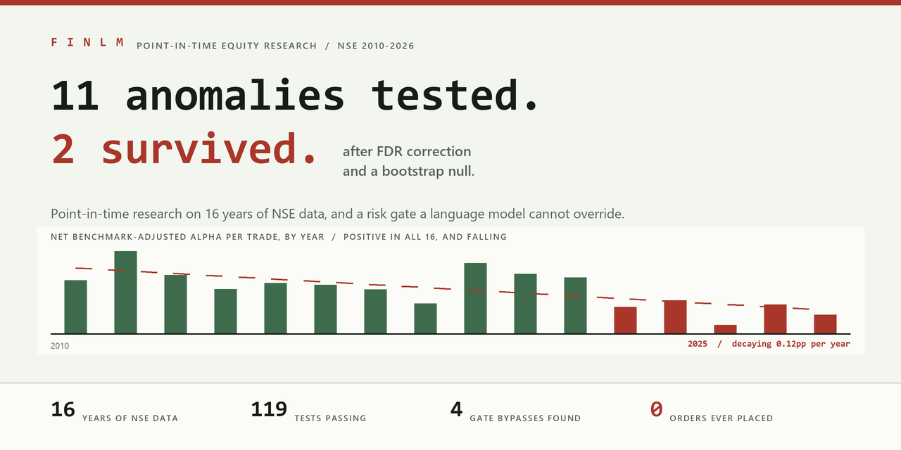

<div align="center">

# finLM

**An AI that researches the Indian stock market, and a risk gate it cannot argue with.**
Eleven published anomalies tested under one methodology. Two survived. Zero orders ever
placed, because the file that would authorise one was deliberately never written.

[](LICENSE)

[](#exposing-the-tools-to-an-mcp-client)


[](https://finlm-ochre.vercel.app/)
[](https://github.com/hasil7677/finLM/stargazers)

</div>

<p align="center">
  
</p>

---

### [Read the case study &rarr;](https://finlm-ochre.vercel.app/)

Five things this project got wrong, how each one was caught, and what survived.

---

**[Skip to: What the data says](#what-the-data-says) &middot;
[Why trust it](#why-these-numbers-are-trustworthy) &middot;
[The risk gate](#the-governance-layer) &middot;
[Setup](#setup) &middot;
[Status](#status) &middot;
[Roadmap](#roadmap)**

---

It is easy to build an AI that suggests stock trades. Thousands of people have.

The hard part, the part almost nobody does, is making the system trustworthy enough that
you would actually connect it to a brokerage account. That takes two things, and both are
tedious: proving the strategy on data that was not quietly cherry-picked, and building
controls the model cannot talk its way around.

finLM is both halves.

**The research half** is 16 years of Indian stock market data, tested carefully enough
that the headline finding turned out to be a strategy that is *dying* rather than one
that works. That is written up as the main result, because it is what the data says.

**The governance half** is a risk gate that decides whether an order is allowed. It was
attacked on the assumption that the AI is adversarial, it broke four different ways, and
all four are fixed with a test suite that keeps them shut.

| | |
|---|---|
| **Headline finding** | Fade alpha positive in **all 16 years** (2010-2025), decaying ~0.12pp/year. Spearman r = −0.653, p = 0.0013. [Details ↓](#what-the-data-says) |
| **Anomaly replication** | 11 published effects tested, **2 survive** Benjamini-Hochberg plus a bootstrap max-\|t\| null (p = 0.012). [Table ↓](#what-the-data-says) |
| **Setup** | `pip install -e ".[dev]"` then `llmfin-ingest`. No account, no API key, free public NSE data. |
| **Talks to** | Claude Code or any MCP client, over stdio or streamable HTTP. 15 tools. |
| **Orders ever placed** | **Zero.** The gate refused every time, by design. [Disclosure ↓](#read-this-first---what-has-and-has-not-been-run) |

```
llmfin-replicate --db ~/.llmfin/market_full.db      # test 11 published anomalies
llmfin-backtest  --entry pullback --cost-pct 0.4    # point-in-time backtest
llmfin-server                                       # MCP server, 15 tools
```

---

## Read this first - what has and has not been run

This project is **research infrastructure and a governance layer**, not a live trading
system. Being precise about that:

| | |
|---|---|
| Backtests over 2010-2026 NSE data | ✅ real, point-in-time, survivorship-verified |
| Decisions journaled with reasoning, scored against real NSE closes | ✅ real - 13 logged |
| Broker integration (Zerodha Kite) implemented | ✅ code exists, unit-tested against a mock |
| **Orders actually placed** | ❌ **zero. Ever.** |
| **Broker account authenticated** | ❌ never - no session token has existed |
| **Capital at risk** | ❌ none |

**No order has ever been placed, because the mandate file that would authorise one was
deliberately never created.** The gate refused every time. That is the design working,
not a missing feature - and it is the most direct demonstration of the thesis in the
repo.

Where you see a return figure (e.g. "+10.31% on the top call"), it is a **paper
decision scored against real closing prices**. Real data, real forward scoring, no
money.

---

## What the data says

Everything below is reproducible from this repo. Every run writes a stamped artifact to
`artifacts/` recording the git commit, the database fingerprint, library versions and
full config - **cite the artifact, don't retype the number.**

### 1. Chasing breakouts destroys value; fading them worked, and is dying

Across **2010-2025, 16 complete years**, a "fade the mover" strategy (short a stock
that just spiked on volume, ATR-based stop and target, 10-day horizon) produced
positive benchmark-adjusted alpha in **every single year**, net of a modelled 0.4%
round-trip cost.

But the effect is **decaying monotonically**:

| 2010 | 2013 | 2016 | 2019 | 2020 | 2021 | 2022 | 2023 | 2024 | 2025 |
|---|---|---|---|---|---|---|---|---|---|
| 2.27% | 1.90% | 1.87% | 2.54% | 2.39% | 1.13% | 1.41% | 0.35% | 1.23% | 0.79% |

- Spearman r = **−0.653, p = 0.0013** (excluding 2020: −0.707, p = 0.0003)
- Slope ≈ **−0.12 percentage points per year**, stable across every specification
- All leave-one-out slopes negative; both COVID treatments agree

A structural-break test put the best split before **2023** - when T+1 settlement
completed, an event named in the pre-registration *before* the data was examined -
but at p = 0.0375 it fails the robustness check (p = 0.0503 excluding 2020), so it is
reported as **suggestive, not established**.

**A caution on the headline statistic.** The sign test is now 16/16 positive,
p = 1/65,536. That is 32× more "significant" than the original 11/11 result - *while
the effect size fell ~78%*. A sign test measures whether the sign is real and says
nothing about magnitude; 16 years of +0.1% would score identically. **The honest
headline is the decay, not the p-value.**

The mirror-image finding is cleaner and needs no caveats: **chasing** breakouts loses
in every configuration tested - roughly **−1.55% per trade net**, n = 1,033.

### 2. Anomaly replication - most published effects don't show up here

Eleven documented equity anomalies (momentum, short-term reversal, 52-week-high,
low-volatility, MAX/lottery, illiquidity, turnover, beta, volume shock, skewness,
long-term reversal) tested on NSE 2010-2024 using standard cross-sectional quintile
portfolio sorts - 290,651 symbol-months, 161 usable months.

**In the liquid, tradeable universe (~134 names/month), essentially nothing survives.**
Widen the universe and two effects appear and hold up:

| anomaly | wide (~445 names) | mid (~234) | liquid (~134) |
|---|---|---|---|
| **momentum (12-1)** | **t = 3.37 / +15.3%** | 2.19 / +9.8% | 1.72 / +6.5% |
| **52-week high** | **t = 3.05 / +15.3%** | 1.87 / +8.1% | 1.29 / +5.1% |
| skewness | t = −2.43 / −8.6% | −3.15 / −11.6% | −1.43 / −8.7% |
| low volatility | 1.80 / +6.1% | 0.50 / −0.4% | 0.33 / −1.0% |
| short-term reversal | −0.92 / −7.9% | −0.13 / −4.5% | −0.22 / −5.1% |

*(gross Newey-West t / annualised net %; the other six are all |t| < 1.3)*

Corrected for multiple testing: **Benjamini-Hochberg at q = 0.10 leaves three
survivors**, and a **bootstrap of the maximum |t| under the null** (returns permuted
within month, 1,000 iterations) gives observed 3.374 vs a null 95th percentile of
2.828, **p = 0.012**. The strict test passes.

Two things worth reading carefully:

- **Skewness is significant but not tradeable.** Its significance is significance of
  *losing money*. Flipped to the profitable direction and re-costed it is ~+0.8%/yr -
  nil. Only momentum and 52-week-high are both significant *and* economically large.
- **Short-term reversal is exactly null at monthly horizon** (gross 0.000%/mo). This
  doesn't contradict finding #1 - it *locates* it. Reversal in India lives at the
  daily/event horizon and does not exist at monthly formation.

A **conditional double sort** (ranking each characteristic *within* liquidity terciles)
confirms these aren't liquidity in disguise: momentum 3.37 → holds, 52-week-high
3.05 → holds. Magnitudes shrink by roughly a third; significance survives.

### 3. The cost hurdle, which is larger than people expect

A **zero-alpha** quintile long-short at ~80% monthly turnover and 0.4% round-trip loses
**6.6% per year** purely to costs. That is the bar every result above has to clear, and
it is asserted as a test rather than left as a footnote.

---

## Why these numbers are trustworthy

The methodology is the actual product. Five things this repo does that most backtests
don't:

**Point-in-time, structurally.** Entries are at the *next day's open* - bhavcopy is
end-of-day, so you cannot act on today's close. The candidate scanner physically
filters the panel to prior rows rather than relying on discipline.

**Survivorship-free, and verified.** The universe is built from per-day NSE bhavcopy
archives, so each row is what actually traded that day. Checked empirically: 2,543
symbols over 2010-2020, of which **771 stop appearing before mid-2020**. The dead are
present and end at their real demise - `SATYAMCOMP` → 2013-07-03, `EDUCOMP` →
2017-09-22, `GITANJALI` → 2018-07-09, `AMTEKAUTO` → 2018-03-28, `JETAIRWAYS` →
2019-09-23, `UNITECH` → 2020-03-09. A symbol list backfilled from today cannot produce
that pattern.

**Benchmark-adjusted.** Every return is measured against an equal-weight liquid-universe
index over the same holding period. A number without a comparator is uninterpretable.

**Costs modelled, not discounted mentally.** `ExitConfig.cost_pct` is subtracted from
every trade; `stats()` reports gross and net side by side.

**Corporate actions back-adjusted, with the audit trail exposed.** Raw bhavcopy has no
split adjustment, so a 1:2 split looks like a −50% crash. The adjuster took two rounds
of real bugs to get right (see [PROJECT_DEEP_DIVE.md](./PROJECT_DEEP_DIVE.md) §4.1) and
every decision it makes is queryable via `list_data_anomalies`.

### Hypotheses are pre-registered, and one was falsified on purpose

`artifacts/prereg_breadth.py` recorded, **before** the data was computed, a prediction
interval and an explicit falsification region for a hypothesis about why fade alpha
varies. The observation landed **outside** the interval, in the direction opposite to
the prediction. The hypothesis was recorded as dead.

The same discipline was applied to the multiple-testing correction and to the decay
analysis - including a **stopping rule** fixed in advance, to prevent an infinite
regress of robustness checks.

### Reproducibility is enforced, after it failed once

An earlier headline figure (935 trades, +1.2% alpha) **could not be reproduced**.
Eighteen parameter combinations were swept; the git history showed the candidate
selection, entry fill and exit defaults were byte-identical to the commit that produced
it. The conclusion: the original run was never captured - a number was read off a
terminal and typed into a document.

`provenance.py` now stamps every run with git SHA *and dirty-tree flag*, a database
fingerprint (rows, date range, SHA-256), library versions and full config. There is a
test asserting no opt-out flag exists.

The superseded figures were kept with a dated correction rather than quietly replaced.

---

## The governance layer

An LLM given a `place_order` tool and an instruction to "always ask first" is not
governed. The reference LLM trading server in India gates real orders behind a
`confirmed=true` parameter **that the model sets itself**. That is theatre.

finLM's answer:

1. **A mandate file** (`risk_limits.json`) the *human* writes, specifying order value
   cap, daily rupee cap, quantity cap, daily order count, allowed products, exchanges,
   and symbol allow/blocklists. **No code path in the package can create it** -
   asserted by a test. Missing file ⇒ orders blocked, not defaulted open.
2. **A filesystem kill switch** - create a file named `KILL_SWITCH` and every order is
   refused until it's deleted. No API, works even if the model is misbehaving.
3. **No bypass parameter**, asserted by a test that fails if anyone adds an argument
   with a bypass-shaped name.

### It was red-teamed, and it lost four times

Assume the model is adversarial. Every input it controls is a `place_order` argument.
Four real bypasses were found and fixed:

| bypass | how it worked |
|---|---|
| **Price spoofing** | `order_type="MARKET", price=1.0, quantity=100` - the gate valued the order at ₹100 and let it through a ₹50,000 cap, while it executed at market for ₹500,000. The exchange ignores `price` on a market order; the gate didn't. |
| **Negative quantity** | `quantity=-100` passes `qty > max_qty` *and* makes `qty × price` negative, clearing both caps at once. |
| **Unicode evasion** | `"YES​BANK"` with a zero-width space, or full-width `ＹＥＳＢＡＮＫ`, slid past a blocklist entry for `YESBANK`. |
| **NaN price** | every comparison with `NaN` is false, so `100 × NaN > 50,000` evaluated false and cleared the cap. |

Plus a fifth found in review: per-order caps don't bound daily exposure, so
`max_daily_value_inr` now sums the order ledger.

All four are one bug wearing four hats - **the gate trusted caller-supplied values as
ground truth.** That is the classic *confused deputy* problem: a program holding
authority the caller lacks, tricked into exercising it because it believed the caller's
description of the request.

The honest claim isn't "our gate is unbypassable." It's **"we attacked our own gate,
found four holes, fixed them, and here is the suite that keeps them shut."**

---

## Setup

```bash
git clone https://github.com/hasil7677/finLM && cd finLM
python -m venv .venv
.venv\Scripts\activate            # Windows;  source .venv/bin/activate on Unix
pip install -e ".[dev]"
cp .env.example .env              # optional: TAVILY_API_KEY for catalyst research
llmfin-ingest                     # build the market DB (~5 min, no accounts needed)
pytest -q                         # 119 tests
```

**Runs with zero credentials** on free public NSE data. API keys only unlock the live
tier (quotes, positions, orders).

Data lives in `~/.llmfin/` (`market.db`, `market_historical.db`, `journal.db`) - not in
the repo, since the databases are large.

### Historical data

```bash
python -m llmfin.historical_ingest --start 2010-01-01 --end 2024-07-31   # old format
llmfin-ingest                                                            # UDiFF, 2024-07 onward
```

⚠ **Never run an analysis against a database while an ingest is writing to it.** SQLite
will lock and kill the ingest, and worse, any analysis that *does* read will silently
use a moving dataset. This cost real debugging time - see PROJECT_DEEP_DIVE.md §4.7.

### Exposing the tools to an MCP client

The server speaks MCP over stdio, or streamable HTTP:

```bash
llmfin-server                     # stdio
llmfin-server --http              # http://127.0.0.1:8747/mcp
```

`mcp_client_config.json` is a ready-made stdio config to merge into your client's
config file. Some desktop clients rewrite their config on exit - if yours does, use
`--http` and add the URL as a connector instead.

### Enabling order placement (deliberately manual)

```bash
cp risk_limits.example.json risk_limits.json    # then EDIT IT YOURSELF
python -m llmfin.auth                           # Kite login, daily
```

Nothing in this codebase will create `risk_limits.json` for you. That is the entire
point - it's consent that has to originate outside the model's reach. To freeze
trading instantly, create a file named `KILL_SWITCH` next to it.

---

## The 15 MCP tools

**Discovery** (free, local data) - `ingest_market_data`, `scan_market`,
`scan_accumulation`¹, `list_data_anomalies`
**Analysis** (free; upgrades with a broker session) - `research_instrument`,
`get_batch_research`, `research_symbol`
**Journal** (the feedback loop) - `log_decision`, `eod_review`, `get_journal`
**Broker** (requires a Kite session) - `get_market_quote`, `search_instruments`,
`get_portfolio_positions`, `place_order`, `get_risk_status`

¹ `scan_accumulation` is **UNVALIDATED** - it has never been through the backtest loop
and declares that in its own returned payload, not just its docstring.

A test asserts the tool list in the source matches the tools actually registered, and
that documented counts across the repo match reality. It caught a real drift.

---

## Design decisions that look like bugs and aren't

**The two alpha models are never averaged.** Summing momentum and mean-reversion scores
is self-cancelling - a strong uptrend scores +1 trend, −1 overbought = HOLD, which
structurally HOLDs exactly the stocks worth trading. They are opposing philosophies;
both opinions are shown and the disagreement is the signal. The backtest confirms it:
they have *opposite signs of alpha*.

**Indicators are hand-rolled, not `pandas_ta`.** That library is unmaintained and breaks
on numpy ≥ 2. Hand-rolling is why this runs on Python 3.14.

**Two data sources with silent fallback.** A broker session upgrades data quality when
present; the free path always works. Screening never requires a paid subscription.

**Broker tokens expire on the IST day boundary**, not UTC. Comparing UTC dates marks
dead tokens as fresh.

**Web research trusts sources, not summaries.** The research provider's synthesised
answer once invented a "positive earnings report" that didn't exist.

---

## Status

Built solo, tested hard, never run with real money. The honest split:

**Solid and verified (119 tests, all passing with zero credentials and no paid data):**
point-in-time backtesting with next-day-open fills and a structurally filtered candidate
panel &middot; a survivorship-free universe built from per-day exchange archives and checked
against named delisted companies &middot; benchmark-adjusted returns with costs modelled in
the simulator rather than discounted afterwards &middot; cross-sectional portfolio sorts with
Newey-West standard errors, Benjamini-Hochberg FDR and a bootstrap max-|t| null &middot;
a risk gate that fails closed with no bypass parameter, red-teamed across 58 adversarial
tests &middot; run provenance stamped on every result with no opt-out, which has already
caught one silently corrupted statistic.

**Known gaps, not hidden:**

- **The measured edge is ~97% short-side.** An Indian retail *cash* account cannot hold
  a multi-day short. Trading this requires futures, which restricts the universe to
  ~180 names and adds roll costs that are **not modelled**. For a cash account the
  honest use is a **de-risking filter** - don't buy the spike - not a return strategy.
- **The edge is decaying** and was down to 0.79% in 2025. Extrapolating the trend, it
  reaches zero within a few years.
- **No market capitalisation data.** Bhavcopy has no shares outstanding, so there is no
  value-weighting and no true size factor. Turnover is a liquidity proxy, not size -
  part of the universe gradient could be size in disguise.
- **No intraday data.** EOD only: no spreads, no order book, no execution modelling.
- **Factor attribution has not been done.** Momentum and 52-week-high have not been
  regressed on size/value/volatility factors. Until that lands they are candidate
  findings, not established alpha.
- **Long-side screening is unvalidated** (`scan_accumulation`).
- **A ~11-month data seam** exists in raw form between the two ingest formats; the
  merged `market_full.db` closes it, and the boundary was validated (100% symbol
  carry-over, no price/volume discontinuity) before use.

---

## Roadmap

The actual order things got worked, not a wishlist. Each item below exists because
something went wrong first.

**Shipped: run provenance, after a headline figure could not be reproduced.** An earlier
result (935 trades, +1.2% alpha) failed to rerun. Eighteen parameter combinations were
swept and the git history showed the code was byte-identical, so the original run had
simply never been captured. Every result-producing run now stamps git SHA plus dirty-tree
flag, a database fingerprint, library versions and full config, with a test asserting no
opt-out flag exists.

**Shipped: the 2021-2024 data gap closed.** The series is now continuous 2010 to 2026,
7,061,494 rows, zero missing trading days. The July-2024 format seam between the two
ingest paths was validated before use (100% symbol carry-over, ordinary returns across
the join, no volatility jump), because without that check the decay finding could have
been a schema artifact.

**Shipped: the decay question resolved, pre-registered first.** Four hypotheses, decision
rules and a stopping rule were written down before any 2021-2024 number existed. Verdict
was H1, monotonic decay: Spearman r = −0.653, p = 0.0013, slope stable at ~0.12pp/year
across every specification, all leave-one-out slopes negative, both COVID treatments
agreeing. The competing breadth hypothesis was falsified against its pre-registered
interval and has since collapsed in-sample too (r = −0.635 → −0.029).

**Shipped: the anomaly replication.** 11 documented effects, one uniform methodology,
290,651 symbol-months. Two survive Benjamini-Hochberg plus a bootstrap max-|t| null. A
conditional double sort inside liquidity terciles confirms they are not liquidity in
disguise.

**Shipped: the gate red-teamed.** 58 adversarial tests written on the assumption the model
is hostile. Four real bypasses found and fixed, plus a fifth gap in review where per-order
caps failed to bound daily exposure.

**Next: factor attribution.** The two surviving anomalies have not been regressed on size,
value and volatility factors. A "spiked on volume" screen loads on volatility and
illiquidity by construction, so some of that 15% could be compensation for known risk
rather than a new effect. This is the single control standing between "candidate finding"
and "result", and it is the first thing anyone competent will ask about. Indian factor
data is published and usable.

**Next: capacity.** Nobody asks how much money a strategy holds, and it is the question that
separates thinking about trading from thinking about backtesting. Model market impact
against each stock's average daily volume and find the point where the edge goes to zero.
Being able to say "this decays to nothing above X crore" is worth more than another
decimal place on the alpha.

**Then: point-in-time F&O eligibility.** The edge is short-side, which needs futures, which
restricts the universe to roughly 180 names. Rerunning restricted to that set answers
whether the *tradeable* subset keeps the edge. The trap: the eligible list changed over
the years, so using today's list on 2010 data reintroduces exactly the lookahead this
project spent so long removing. Historical eligibility lists are the hard part.

**Then: re-validate the data seam as the range extends.** The series is continuous 2010 to 2026 in the merged
database, but it is assembled from two ingest formats meeting in July 2024. That boundary
was validated and is clean, and it should be re-validated whenever the range extends.

**Then: a cross-repo bypass survey.** The four gate bypasses are a taxonomy, and the taxonomy is
only interesting if it generalises. Checking the same six classes against other
open-source LLM systems with live execution paths would turn one anecdote into a
prevalence claim. It needs responsible disclosure to maintainers first, since those are
systems people run with real money.

Deliberately **not** on the list: more resampling of the anomaly results. The
pre-registered stopping rule says three survivors sends you to factor attribution, not to
a block bootstrap. Every robustness check suggests another one, and a project can polish
itself to death.

## Repository layout

```
src/llmfin/
  server.py             MCP server, 15 tools (FastMCP), stdio + --http
  data_store.py         NSE bhavcopy → SQLite (UDiFF format, 2024-07 onward)
  historical_ingest.py  Pre-2024 bhavcopy backfill (separate DB)
  corporate_actions.py  Split/bonus back-adjustment, shared by backtest + live
  scanner.py            Deterministic whole-universe mover screen
  accumulation_scanner.py  Long-side screen - UNVALIDATED
  indicators.py         RSI/MACD/Bollinger/EMA/ATR, hand-rolled
  signals.py            Trend-following + mean-reversion models, never averaged
  market_research.py    Per-symbol pipeline
  research_web.py       Catalyst search ("why did it move")
  journal.py            Decision log with thesis + outcome scoring
  risk.py               Mandate, kill switch, caps - the governance core
  backtest.py           Point-in-time event simulator
  anomalies.py          Cross-sectional portfolio-sort engine + FDR/bootstrap
  portfolio_backtest.py Shared-book sequencing, sizing, drawdown
  regime_analysis.py    Per-year alpha vs volatility/breadth
  provenance.py         Run artifacts - git SHA, data fingerprint, config
  diagnostics.py        Corporate-action audit trail
tests/                  119 tests
artifacts/              Stamped run outputs + pre-registrations
```

**[PROJECT_DEEP_DIVE.md](./PROJECT_DEEP_DIVE.md)** - a long-form walkthrough written for
readers with no trading background: the concepts from zero, the project timeline, and
deep dives on every incident (the adjuster bugs, the gate bypasses, the unreproducible
headline, the falsified hypothesis, the anomaly study).

---

## ⚠️ Disclaimer

**Not investment advice.** This is research and engineering work, published for
inspection. Nothing here is a recommendation to buy or sell any security. The strategies
described are demonstrably decaying, largely untradeable in a retail cash account, and
have never been executed with real money. Backtested results are not indicative of
future returns. If you connect this to a funded brokerage account, you do so entirely at
your own risk.
